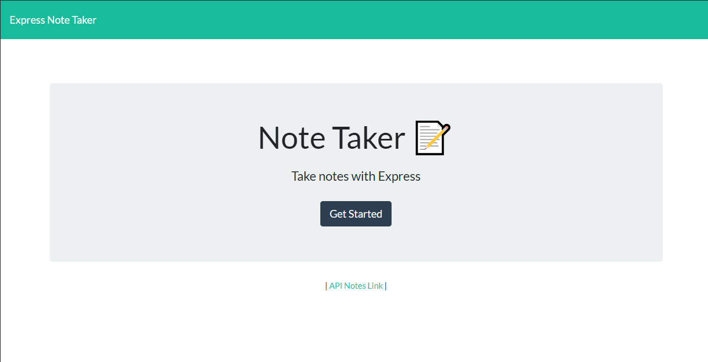
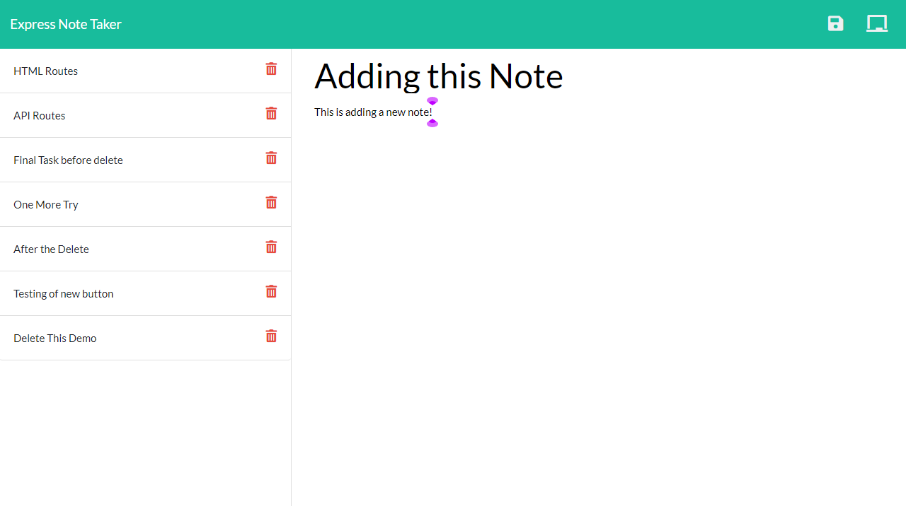

# Take Express Notes

License: 

## Description 

This is an Express note taking app for all your daily, weekly, or monthly tasks so they don't get lost. You can write your notes and save them on the server. Ypu can delete the notes if they are no longer needed. 

## Table of Contents

* [Installation](#installation)
* [Usage](#usage)
* [License](#license)
* [Contributing](#contributing)
* [Tests](#tests)
* [Questions](#questions)

## Installation

The application is live on heroku with the address below. 

[https://take-express-notes.herokuapp.com/](https://take-express-notes.herokuapp.com/)

Screenshots:

## Usage 

- Open the app and click on the 'Get Started' button to get started
- Notes page with existing notes will appear on the left hand side
  - Enter the new notes on the right side with the title and the text for the notes
  - Click on the save icon on the top-right that looks like a diskette to save your note
  - Once you save the note it will appear on the list on the left hand side
- Click on the notes you want to view on the left hand side 
  - The note you selected will appear on the right side
- If you want to add a new note to your list
  - Click on the icon of a blank chalkboard on the top right corner
  - The fields for the title and text will be blank and ready for you to enter your note on the right side

## License

MIT

## Contributing

You can fork a copy of the repo and make your own modifications. Request a push for the change and I will review them. 

## Tests

There are currently no tests for this application. Tests may be available in future releases. 

## Questions

If you have any questions, feel free to contact me and listed below are my contact informations. 

GitHub profile: code-monkey713

Email: codemonkey713@gmail.com

